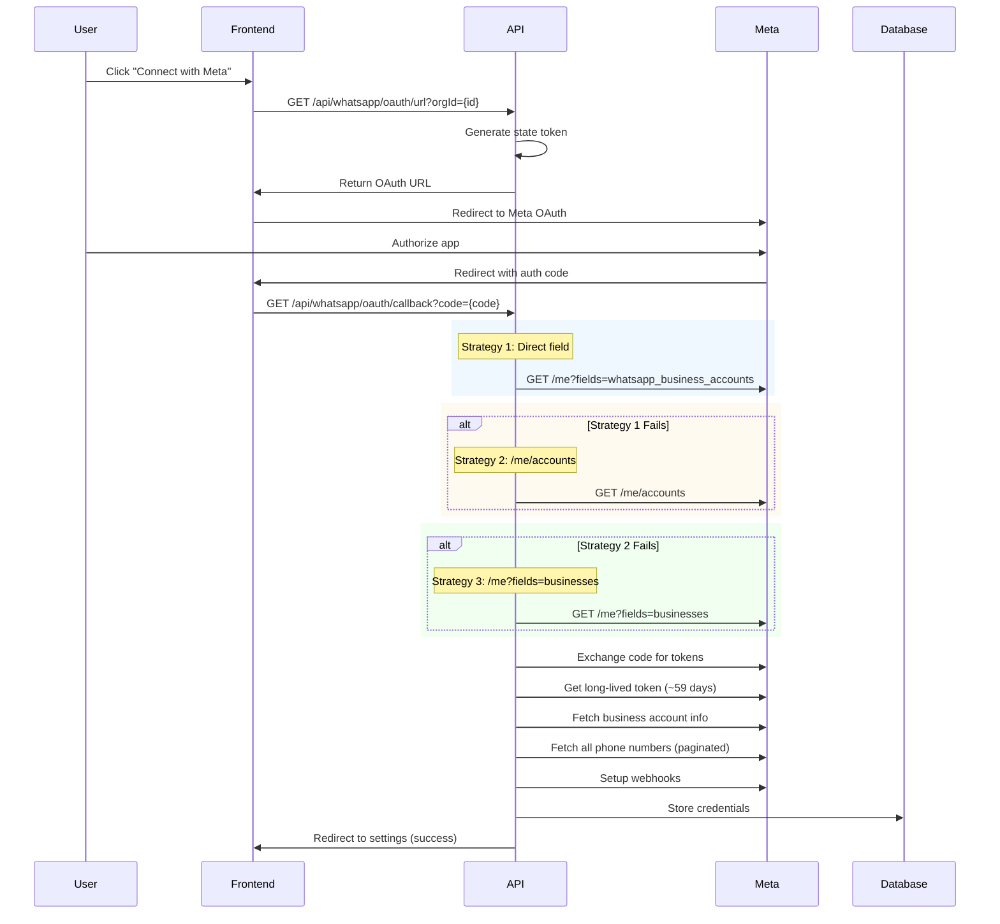
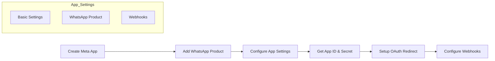
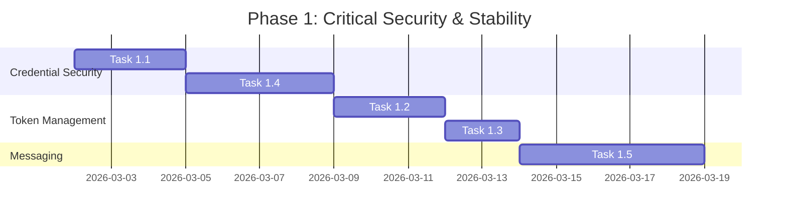
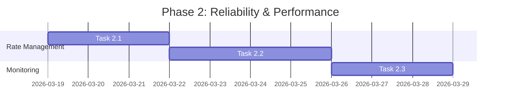
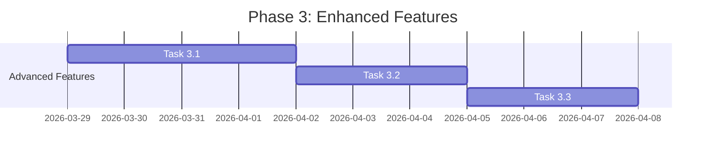

# WhatsApp Cloud API Setup Analysis - Comprehensive Report

**Document Version:** 1.0  
**Date:** March 2, 2026  
**Classification:** Internal Technical Documentation  
**Status:** Analysis Complete

---

## 1. Executive Summary

This report provides a comprehensive analysis of the current WhatsApp Cloud API implementation within the WhatsApp Marketing Tool. The system currently supports two connection methods:

1. **OAuth Flow (Primary)** - Embedded OAuth for seamless Meta Business Account connection
2. **Manual Configuration (Fallback)** - Direct API credential input

### Key Findings

| Aspect | Current Status | Priority |
|--------|---------------|----------|
| OAuth Implementation | ✅ Complete | - |
| Manual Configuration | ✅ Complete | - |
| Token Auto-Refresh | ⚠️ Partial (manual trigger only) | High |
| Credential Encryption | ❌ Not Implemented | High |
| Rate Limiting | ❌ Not Implemented | Medium |
| Token Expiration Alerts | ❌ Not Implemented | High |
| Multi-Account Support | ⚠️ Limited | Medium |
| Incoming Message Handling | ⚠️ Partial | High |
| Phone Registration API | ⚠️ Not Fully Exposed | Medium |
| Periodic Health Checks | ⚠️ Partial | Medium |

### Recommendation Summary

The current implementation provides a solid foundation for WhatsApp Cloud API integration. However, **10 critical gaps** have been identified that require attention to ensure production-ready reliability, security, and user experience. This report provides a detailed roadmap for addressing these gaps with prioritized task lists.

---

## 2. Current State Analysis

### 2.1 Architecture Overview

```mermaid
flowchart TB
    subgraph Frontend
        UI[WhatsAppSettingsTab.tsx]
    end
    
    subgraph API_Layer
        OAuth_URL[/api/whatsapp/oauth/url]
        OAuth_CB[/api/whatsapp/oauth/callback]
        Settings[/api/settings/whatsapp]
        Webhooks[/api/whatsapp/webhooks]
        Phone_Numbers[/api/whatsapp/phone-numbers]
        Disconnect[/api/whatsapp/disconnect]
    end
    
    subgraph Services
        OAuth_Service[whatsapp-oauth.ts]
        WA_Client[whatsapp/client.ts]
        Auth[whatsapp/auth.ts]
    end
    
    subgraph Database
        Cred[WhatsAppCredential]
        Phone[WhatsAppPhoneNumber]
        Legacy[Legacy Settings]
    end
    
    subgraph Meta_API
        Graph_API[Meta Graph API]
    end
    
    UI --> OAuth_URL
    UI --> Settings
    OAuth_URL --> OAuth_Service
    OAuth_CB --> OAuth_Service
    Settings --> OAuth_Service
    OAuth_Service --> Graph_API
    WA_Client --> Graph_API
    Auth --> Cred
    Auth --> Legacy
    Cred --> Phone
```

### 2.2 Current Implementation Components

#### Database Models (Prisma Schema)

**WhatsAppCredential Model**
```prisma
model WhatsAppCredential {
  id                        String   @id
  organizationId            String   @unique
  accessToken               String   // ⚠️ Stored in plaintext
  businessAccountId         String
  businessAccountName       String?
  messageTemplateNamespace  String?
  phoneNumberId             String?
  tokenExpiresAt            DateTime?
  webhookVerifyToken        String?
  webhookUrl               String?
  isActive                  Boolean  @default(true)
  connectedAt               DateTime
  connectedDevice           String?
  lastVerifiedAt            DateTime?
  phoneNumbers              WhatsAppPhoneNumber[]
}
```

**WhatsAppPhoneNumber Model**
```prisma
model WhatsAppPhoneNumber {
  id                 String   @id
  organizationId     String
  displayName        String
  phoneNumber        String
  verificationStatus String   @default("PENDING")
  qualityScore       String?
  isDefault          Boolean  @default(false)
}
```

#### Current API Endpoints

| Endpoint | Method | Purpose | Status |
|----------|--------|---------|--------|
| `/api/whatsapp/oauth/url` | GET | Generate OAuth authorization URL | ✅ Complete |
| `/api/whatsapp/oauth/callback` | GET | Handle OAuth callback & token exchange | ✅ Complete |
| `/api/settings/whatsapp` | GET | Fetch WhatsApp settings & status | ✅ Complete |
| `/api/settings/whatsapp` | PUT | Save manual credentials | ✅ Complete |
| `/api/settings/whatsapp` | POST | Set default phone number | ✅ Complete |
| `/api/settings/whatsapp` | DELETE | Remove phone number | ✅ Complete |
| `/api/whatsapp/disconnect` | POST | Disconnect WhatsApp account | ✅ Complete |
| `/api/whatsapp/webhooks` | GET | Webhook verification | ✅ Complete |
| `/api/whatsapp/webhooks` | POST | Handle incoming webhooks | ⚠️ Partial |
| `/api/whatsapp/phone-numbers` | GET | Fetch phone numbers | ✅ Complete |

### 2.3 OAuth Flow Implementation

The OAuth flow implements **three fallback strategies** for discovering WhatsApp Business Accounts:



---

## 3. WhatsApp Cloud API Setup Flow

### 3.1 Method 1: OAuth Flow (Recommended)

#### Prerequisites
- Meta Developer Account
- WhatsApp Product enabled in Meta App
- App ID and App Secret configured in environment variables

#### Environment Variables Required
```bash
META_APP_ID=your_facebook_app_id
META_APP_SECRET=your_facebook_app_secret
META_OAUTH_REDIRECT_URI=https://your-domain.com/api/whatsapp/oauth/callback
NEXT_PUBLIC_APP_URL=https://your-domain.com
```

#### OAuth Flow Steps

1. **Initiation**: User clicks "Connect with Meta" button
2. **URL Generation**: Backend generates OAuth URL with proper scopes:
   - `whatsapp_business_management`
   - `whatsapp_business_messaging`
3. **Authorization**: User authenticates with Meta and grants permissions
4. **Token Exchange**:
   - Short-lived token → Long-lived token (~59 days)
   - Business Account discovery (3 strategies)
5. **Data Fetching**:
   - Business account details (name, namespace)
   - All phone numbers with pagination
6. **Webhook Setup**: Automatic subscription to:
   - `messages`
   - `message_template_status`
   - `phone_number_quality`
   - `account_alerts`
7. **Storage**: Credentials saved to database

### 3.2 Method 2: Manual Configuration

#### Prerequisites
- Meta Developer Account
- WhatsApp Business Account
- Temporary Access Token (from Meta Business Manager)

#### Manual Setup Steps

1. **Access Meta Business Manager**
   - Navigate to: https://business.facebook.com
   - Select your Business Account
   - Go to WhatsApp → Settings → API Setup

2. **Collect Credentials**
   - **Temporary Access Token**: Copy from API Setup page
   - **Phone Number ID**: Found in "Phone Numbers" section
   - **Business Account ID**: Found in "Business Account" section

3. **Input in Application**
   - Navigate to Settings → WhatsApp
   - Enter API Access Token
   - Enter Phone Number ID
   - Enter Business Account ID
   - Optionally add Webhook Secret
   - Click "Save Configuration"

4. **Validation Process**
   ```typescript
   // The system performs:
   // 1. Validate Phone Number ID against Meta API
   // 2. Validate Business Account ID against Meta API
   // 3. Fetch all phone numbers
   // 4. Save to database
   ```

### 3.3 Facebook Developer Account Setup (Detailed)



#### Step-by-Step Guide

1. **Create Meta Developer Account**
   - Visit: https://developers.facebook.com/
   - Click "My Apps" → "Create App"
   - Select "Other" → "Business"
   - Fill in app details

2. **Add WhatsApp Product**
   - Find "WhatsApp" in products catalog
   - Click "Set Up"
   - Complete business verification if required

3. **Get API Credentials**
   - Navigate to WhatsApp → API Setup
   - Note Temporary Access Token (expires in 24h)
   - Note Phone Number ID
   - Note Business Account ID

4. **Configure OAuth**
   - Go to App Settings → Advanced
   - Add redirect URI: `https://your-domain.com/api/whatsapp/oauth/callback`
   - Save changes

5. **Configure Webhooks**
   - Navigate to WhatsApp → Webhooks
   - Enter webhook URL: `https://your-domain.com/api/whatsapp/webhooks`
   - Enter verify token (generate secure random string)

---

## 4. Gap Analysis

### 4.1 Critical Gaps

| # | Gap | Severity | Current State | Impact |
|---|-----|----------|---------------|--------|
| 1 | **Facebook App ID/Secret in UI** | 🔴 High | Only in env vars | Cannot reconfigure without redeployment |
| 2 | **Token Auto-Refresh Scheduling** | 🔴 High | Manual trigger only | Tokens expire after 59 days silently |
| 3 | **Token Expiration Alerts** | 🔴 High | Not implemented | Users unaware of pending expiration |
| 4 | **Credential Encryption** | 🔴 High | Plaintext storage | Security vulnerability |
| 5 | **Incoming Message Handling** | 🔴 High | Partial implementation | Cannot receive customer replies |

### 4.2 Medium Priority Gaps

| # | Gap | Severity | Current State | Impact |
|---|-----|----------|---------------|--------|
| 6 | **Rate Limiting** | 🟡 Medium | Not implemented | API quota issues |
| 7 | **Multi-Account Support** | 🟡 Limited | Single account only | Cannot manage multiple WA accounts |
| 8 | **Phone Registration API** | 🟡 Partial | Not fully exposed | Cannot register new numbers |
| 9 | **Periodic Health Checks** | 🟡 Partial | Manual check only | No automated monitoring |
| 10 | **Message Queue with Retry** | 🟡 Basic | Simple retry (1x) | Failed messages lost |

### 4.3 Detailed Gap Analysis

#### Gap 1: Facebook App ID/App Secret in UI

**Current State:**
```typescript
// Only available via environment variables
const appId = process.env.META_APP_ID;
const appSecret = process.env.META_APP_SECRET;
```

**Issue:** Administrators cannot change OAuth credentials without redeploying the application.

**Required Implementation:**
- Add UI fields for App ID and App Secret
- Store in secure configuration storage
- Validate credentials on save
- Provide clear error messages

#### Gap 2: Token Auto-Refresh Scheduling

**Current State:**
```typescript
// Function exists but no automated scheduling
export async function forceRefreshToken(orgId?: string): Promise<boolean> {
  // Manual trigger only
}
```

**Issue:** Long-lived tokens expire after ~59 days. No automated mechanism to refresh them proactively.

**Required Implementation:**
- Cron job or scheduled task
- Refresh at 50-day mark (before expiration)
- Fallback notification if refresh fails

#### Gap 3: Token Expiration Alerts

**Current State:** Not implemented

**Required Implementation:**
- Dashboard notification when token < 14 days to expire
- Email notification option
- Visual indicator in settings page

#### Gap 4: Credential Encryption

**Current State:**
```prisma
accessToken String  // ⚠️ Stored in plaintext
```

**Required Implementation:**
- AES-256 encryption for access tokens
- Key management system
- Decryption on-the-fly for API calls

#### Gap 5: Incoming Message Handling

**Current State:**
```typescript
// Webhook endpoint exists but incomplete
if (payload.type === "inbound") {
  // Partial implementation
}
```

**Required Implementation:**
- Complete inbound message parsing
- Contact creation/update
- Conversation threading
- Real-time inbox display

---

## 5. Required Configuration Steps

### 5.1 Environment Configuration

```bash
# Required Environment Variables
META_APP_ID=1234567890123456
META_APP_SECRET=your_app_secret_here
META_OAUTH_REDIRECT_URI=https://your-domain.com/api/whatsapp/oauth/callback
WHATSAPP_WEBHOOK_VERIFY_TOKEN=your_secure_verify_token
WHATSAPP_WEBHOOK_SECRET=your_webhook_secret
NEXT_PUBLIC_APP_URL=https://your-domain.com

# Optional
MONGODB_URI=mongodb://localhost:27017/whatsapp-marketing
```

### 5.2 Database Schema Requirements

Ensure the following indexes exist:

```prisma
// WhatsAppCredential indexes
@@unique([organizationId])
@@index([isActive])

// WhatsAppPhoneNumber indexes
@@index([organizationId])
@@index([isDefault])
```

### 5.3 Required API Permissions

When setting up Meta App, ensure these permissions are requested:

| Permission | Purpose | Required |
|------------|---------|----------|
| `whatsapp_business_management` | Manage WhatsApp Business Account | ✅ Yes |
| `whatsapp_business_messaging` | Send/Receive messages | ✅ Yes |

---

## 6. Complete Task List with Priorities

### Priority 1: Critical (Must Fix Before Production)

#### Task 1.1: Add App ID/Secret Configuration to UI
- [ ] Create new API endpoint for storing OAuth configuration
- [ ] Add UI form fields in Settings → WhatsApp → Configuration
- [ ] Implement credential validation on save
- [ ] Update environment variable fallback

#### Task 1.2: Implement Token Auto-Refresh
- [ ] Create background job/edge function for token refresh
- [ ] Schedule refresh at 50-day interval
- [ ] Handle refresh failures gracefully
- [ ] Add logging for audit trail

#### Task 1.3: Add Token Expiration Alerts
- [ ] Add expiration check on settings page load
- [ ] Create notification system for expiring tokens
- [ ] Add email alert option (configurable)
- [ ] Display visual warning in dashboard

#### Task 1.4: Implement Credential Encryption
- [ ] Generate encryption key on first run
- [ ] Encrypt accessToken before database storage
- [ ] Decrypt on-the-fly when making API calls
- [ ] Implement key rotation mechanism

#### Task 1.5: Complete Incoming Message Handling
- [ ] Parse all inbound message types (text, image, audio, video, document)
- [ ] Create/update contacts from incoming messages
- [ ] Implement conversation threading
- [ ] Add to inbox for real-time display

### Priority 2: High (Important for Reliability)

#### Task 2.1: Implement Rate Limiting
- [ ] Track API calls per phone number
- [ ] Implement 1,000 messages/day limit warning
- [ ] Add rate limit headers to responses
- [ ] Queue messages when limit approached

#### Task 2.2: Implement Message Queue with Retry
- [ ] Create message queue table in database
- [ ] Implement exponential backoff retry (3 attempts)
- [ ] Add dead-letter queue for failed messages
- [ ] Provide UI for retry/resend failed messages

#### Task 2.3: Add Periodic Health Checks
- [ ] Create health check endpoint
- [ ] Verify API token validity
- [ ] Check webhook configuration
- [ ] Monitor phone number status

### Priority 3: Medium (Enhanced Functionality)

#### Task 3.1: Enhance Multi-Account Support
- [ ] Allow connecting multiple WhatsApp accounts
- [ ] Implement account selector in UI
- [ ] Separate credentials per organization
- [ ] Handle account switching gracefully

#### Task 3.2: Expose Phone Registration API
- [ ] Add endpoint to register new phone numbers
- [ ] Implement verification code handling
- [ ] Create registration wizard UI
- [ ] Handle registration failures

#### Task 3.3: Add Comprehensive Analytics
- [ ] Track message delivery rates
- [ ] Monitor quality scores
- [ ] Generate usage reports
- [ ] Display metrics in dashboard

### Priority 4: Low (Nice to Have)

#### Task 4.1: Improve Error Messages
- [ ] Add user-friendly error descriptions
- [ ] Provide troubleshooting guides
- [ ] Add "Need Help?" links

#### Task 4.2: Add Dark Mode Support
- [ ] Update UI components for dark theme
- [ ] Test OAuth button visibility
- [ ] Verify contrast ratios

---

## 7. Implementation Roadmap

### Phase 1: Critical Security & Stability (Week 1-2)



**Deliverables:**
- ✅ Secure credential storage
- ✅ Automated token refresh
- ✅ Token expiration notifications
- ✅ Complete incoming message handling

### Phase 2: Reliability & Performance (Week 3-4)



**Deliverables:**
- ✅ Rate limiting implementation
- ✅ Message queue with retry
- ✅ Health check monitoring

### Phase 3: Enhanced Features (Week 5-6)



**Deliverables:**
- ✅ Multi-account support
- ✅ Phone registration API
- ✅ Analytics dashboard

---

## 8. Appendix

### A. Environment Variables Reference

| Variable | Required | Description | Example |
|----------|----------|-------------|---------|
| `META_APP_ID` | Yes | Facebook App ID | `1234567890123456` |
| `META_APP_SECRET` | Yes | Facebook App Secret | `abc123...` |
| `META_OAUTH_REDIRECT_URI` | Yes | OAuth callback URL | `https://domain.com/api/whatsapp/oauth/callback` |
| `WHATSAPP_WEBHOOK_VERIFY_TOKEN` | Yes | Webhook verification token | `random_string` |
| `WHATSAPP_WEBHOOK_SECRET` | No | Webhook signing secret | `webhook_secret` |
| `NEXT_PUBLIC_APP_URL` | Yes | Public app URL | `https://domain.com` |

### B. API Error Codes Reference

| Code | Error | Solution |
|------|-------|----------|
| 100 | Invalid parameter | Check API parameters |
| 190 | Token expired | Reconnect via OAuth |
| 200 | Permission denied | Check app permissions |
| 4 | Rate limit exceeded | Wait and retry |
| 1300 | Phone number not found | Verify Phone Number ID |
| 1320 | Phone number not verified | Complete verification |

### C. Database Schema Changes Required

```prisma
// Add encryption key storage
model WhatsAppCredential {
  // ... existing fields
  encryptionKeyId String?  // Reference to encryption key
  lastRefreshedAt DateTime?
  refreshFailedAt DateTime?
  lastAlertSentAt DateTime?
}

// Add message queue table
model MessageQueue {
  id String @id @default(auto())
  contactId String
  campaignId String?
  payload String  // JSON
  status String @default("pending")  // pending, processing, failed, completed
  retryCount Int @default(0)
  scheduledAt DateTime
  processedAt DateTime?
  failureReason String?
  createdAt DateTime @default(now())
}
```

---

**Document Prepared By:** Architecture Team  
**Next Review Date:** After Phase 1 Completion  
**Approved By:** Technical Lead
